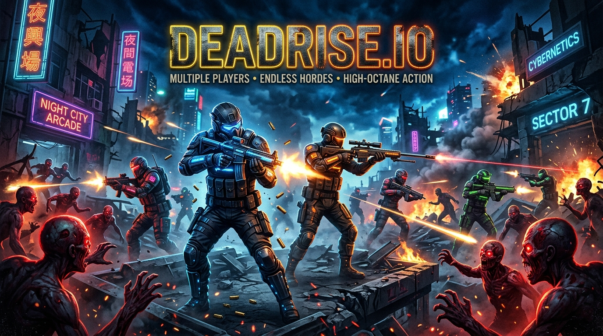

# 🎯🧟 DEADRISE.IO: Multiplayer Combat & Zombie Shooter
### Built for the Handshake AI Skills Studio × OpenAI Multiplayer Game Challenge



**DEADRISE.IO** is an intense, fast-paced browser `.io` multiplayer action shooter inspired by hits like *Deadrise.io* and *Deadshot.io*. 

---

## ⚡ Key Highlights & Features

- **🔗 Instant Room Sharing URL:** 
  Click **"📋 COPY SHARING URL"** or scan the on-screen **QR Code** to generate a direct match link (e.g. `http://localhost:3000/?room=ABCD`). Anyone clicking the link drops directly into your live squad battle!
- **🎮 Dual Game Modes:**
  1. **🎯 DEADSHOT PvP:** Free-for-All tactical deathmatch across a tactical bunker compound with live leaderboards, headshots, and killstreaks.
  2. **🧟 DEADRISE HORDE:** Co-operative survival mode where your squad defends against escalating waves of mutant zombie hordes.
- **🔫 Arsenal & Loadouts:**
  - **Assault Rifle (M4):** Reliable high-RPM automatic spray.
  - **Combat Shotgun:** High burst spread for close-quarters breach.
  - **Heavy Sniper Rifle:** 1-shot high-damage long-range precision.
  - **Plasma Launcher:** Heavy explosive splash damage.
- **⚡ Fluid Movement Mechanics:** 360° mouse/touch aiming, sprint boost, tactical tactical reloading (`R`), stamina meter, armor & health recovery crates.
- **🤖 Built-in AI Combat Bots:** Click `+ Add AI Combat Bot` to instantly populate matches with bots that aim, strafe, and shoot.
- **📱 Universal Cross-Device Play:** Full desktop keyboard/mouse + mobile touch controls (virtual joystick, fire, sprint, reload).

---

## 🕹️ Controls Guide

| Action | Desktop Controls | Mobile Touch Controls |
| :--- | :--- | :--- |
| **Move** | `W` / `A` / `S` / `D` or Arrows | On-Screen Left Joystick |
| **Aim & Shoot** | `Mouse Aim` + `Left Click` | Touch Screen & `🔥 FIRE` |
| **Sprint** | `LEFT SHIFT` | `⚡ SPRINT` Button |
| **Reload** | `R` Key | `🔄 RELOAD` Button |
| **Invite Friends** | `🔗 SHARE MATCH LINK` Button | QR Code or Direct Link |

---

## 🚀 Quick Start (Local Run)

```bash
npm install
node server.js
```
Open **`http://localhost:3000`** in your browser to play!

---

## 🏆 Official Contest Submission Deliverables

- **a. Project Title:** `DEADRISE.IO: Multiplayer Combat & Zombie Shooter`
- **b. Project Cover Image:** `cover.jpg`
- **c. Project Description:** A fast-paced .io real-time multiplayer arena shooter featuring instant URL room sharing, tactical PvP Deathmatch and co-op Zombie Horde survival modes, diverse weapon arsenals, and smart AI bots.
- **d. Project Link / URL:** `http://localhost:3000` *(or live cloud URL on Render / Glitch)*
